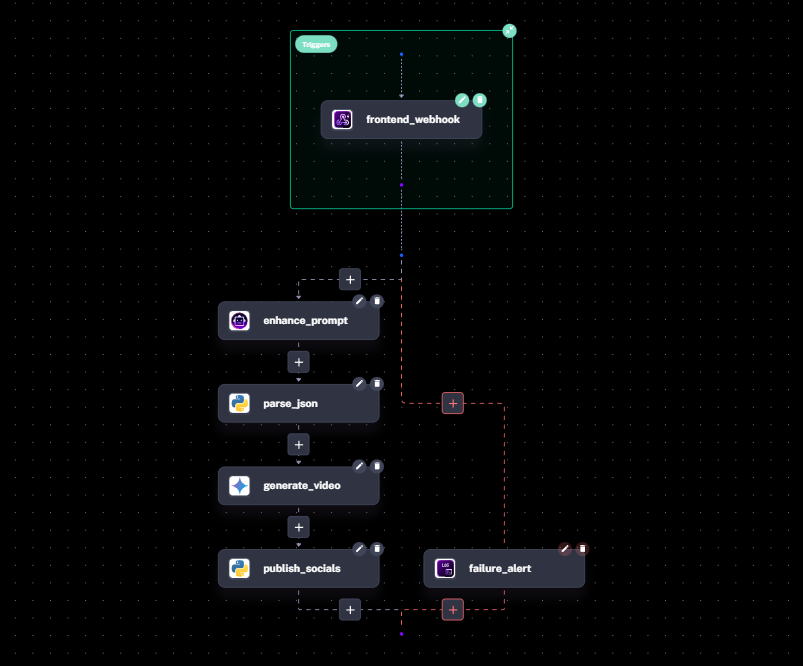
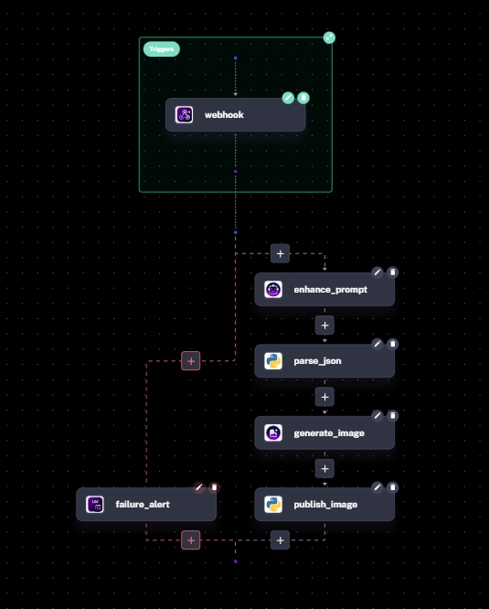

# Sento AI

## About

Sento AI is an intelligent social media automation platform that empowers creators and businesses to manage their online presence effortlessly. Using AI agents, Sento generates engaging content, creates reels, and posts directly to Instagram and Facebook — all from a simple text prompt.

## [Live Link](https://sento-ai.vercel.app)
## The Problem

Small and medium businesses (MSMEs) often lack access to expensive marketing teams and professional social media expertise. Creating consistent, high-quality content across multiple platforms is time-consuming and requires skills that many entrepreneurs simply don't have. 

**Sento AI bridges this gap** by providing an AI-powered solution that automates content creation and publishing, allowing business owners to focus on what they do best — running their business.

## Tech Stack

| Technology | Purpose |
|------------|---------|
| **Next.js** | Frontend framework for the web application |
| **Kestra** | Workflow orchestration engine for AI pipelines |
| **Google Gemini API** | AI-powered content generation and prompt enhancement |
| **ImageKit** | Media storage and content delivery (containerization) |
| **Vercel** | Hosting the frontend |
| **Meta Graph API** | API to interact with Meta App Suite |

---

## Kestra Automation Flows

Sento AI uses Kestra to orchestrate complex AI workflows. Here's how each flow works:

### 🎬 Reel Generation Flow

**Flow: `agentic_video_director.yml`**

This flow transforms a simple text prompt into a fully produced Instagram Reel:

1. **Receives** the user's prompt via webhook
2. **Enhances** the prompt using Gemini AI for better video generation
3. **Generates** a video using Google Veo 3.1
4. **Adds** background audio to make the reel engaging
5. **Creates** a catchy caption with relevant hashtags
6. **Uploads** the video to ImageKit for hosting
7. **Publishes** directly to Instagram as a Reel

---

### 🖼️ Image Post Flow

**Flow: `agentic_image_poster.yml`**

This flow creates stunning image posts from text descriptions:

1. **Receives** the user's creative prompt
2. **Enhances** the prompt with Gemini for photorealistic results
3. **Generates** a high-quality image using Google Imagen
4. **Creates** an engaging caption with trending hashtags
5. **Uploads** the image to ImageKit
6. **Posts** to Instagram feed automatically

---

### 💬 Auto-Reply Flow

**Flow: `instagram_auto_reply.yaml`**

This flow handles audience engagement automatically:

1. **Listens** for new comments via Meta webhook
2. **Verifies** the webhook signature for security
3. **Analyzes** the comment sentiment using AI
4. **Generates** a contextual, on-brand reply
5. **Posts** the reply to the comment thread
6. **Logs** the interaction for analytics

---

## Architecture

The platform follows a modern microservices architecture:

- **Frontend**: Next.js application handling user interactions
- **Orchestration**: Kestra manages all AI workflows and API integrations
- **AI Layer**: Google Gemini for text, Imagen for images, Veo for videos
- **Storage**: ImageKit for media hosting and CDN delivery
- **Publishing**: Direct integration with Meta Graph API for Instagram/Facebook

---
## Note: 
- **To run the project, you must first setup Kestra using Docker Compose and the Next app locally. Deployed version is just for frontend. 

---
## Getting Started

1. Clone the repository
2. Copy `docker-compose.yml` from this repo
3. Add your API keys (Base64 encoded) to the environment
4. Run `docker compose up -d`
5. Access Kestra at `http://localhost:8080`
6. Run the Next.js app with `pnpm dev`

For detailed setup instructions, visit the [Documentation](https://sento-ai.vercel.app/docs).

---

Built with ❤️ by Khushal Agarwal
